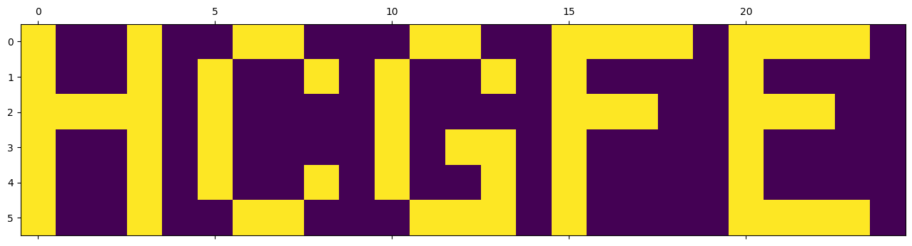

# day 8

```python
import pandas as pd
import numpy as np
import matplotlib.pyplot as plt


df = pd.read_csv("input.txt", header=None, names=["c"])
input_string = df["c"].values[0]

s = list(range(150, 15150, 150))


def get_num(x, n=0):
    return list(x).count(str(n))


def make_layer_array(x: str) -> np.array:
    a = np.array([int(x) for x in list(x)])
    return a.reshape(6, 25)


layers = list()
layer_num = 0
num_zeros = 100000000
i_p = 0
best_layer = 0
best_string = ""


for i in s:
    if layer_num == 0:
        A = make_layer_array(input_string[i_p:i])[..., np.newaxis]
    else:
        A = np.dstack((A, make_layer_array(input_string[i_p:i])[..., np.newaxis]))
    layer_num += 1

    if get_num(input_string[i_p:i]) < num_zeros:
        num_zeros = get_num(input_string[i_p:i])
        best_layer = layer_num
        best_string = input_string[i_p:i]
    i_p = i

result = get_num(best_string, n=1) * get_num(best_string, n=2)

print("part 1:", result)
# 0 is black, 1 is white, and 2 is transparent.
# 25 pixels wide and 6 pixels tall

R = np.zeros((6, 25))

for x in range(A.shape[0]):
    for y in range(A.shape[1]):
        for k in A[x, y, :]:
            if k != 2:
                R[x, y] = k
                break

plt.matshow(R)
plt.savefig("result.png", bbox_inches="tight")
plt.close()
```


